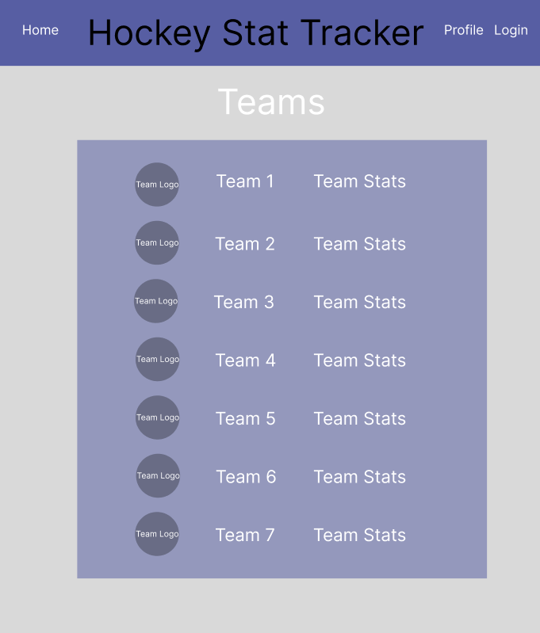
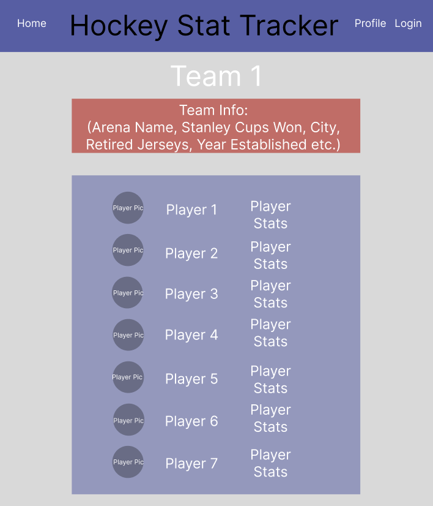
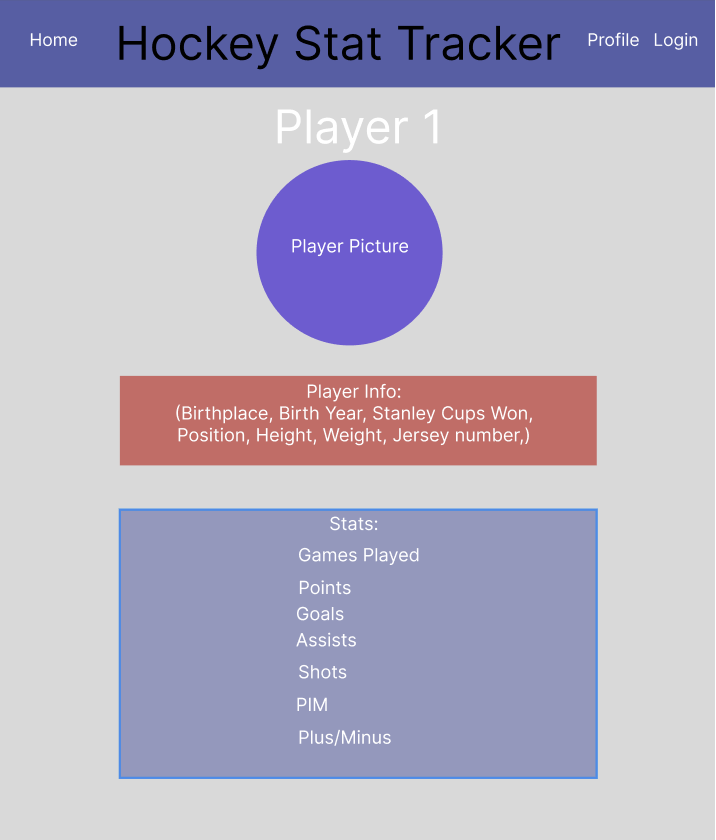
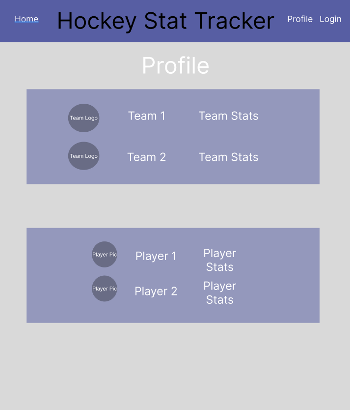
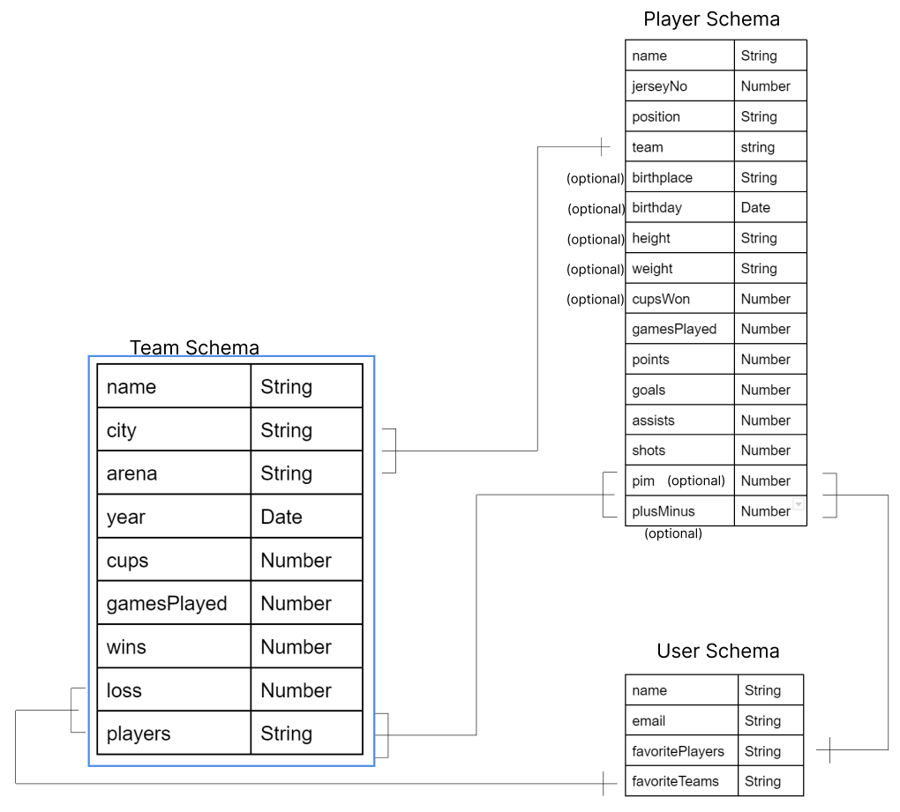

# Hockey Stats

## Description

This is my stat tracker, here add or find your favorite NHL players and teams and keep track of their stats.
- Start by signing into your google account to make a profile. If you do not sign in you will not be able to add teams or players, also will not be able to edit players.
- Home page will show a list of all teams
- Team pages will display team stats and player list you can click a player to see their profile
- nav bar to see your profile and see your favoutire teams and players.
- add/edit team page
- add/edit player page

 ## Technologies

- HTML
- CSS
- javaScript
- EJS
- Node
- MongoDB
- Express
- OAuth
- Trello
- figma(for ERD and wireframe)

## Screenshots

 ## Wireframe

## ERD

## Trello

https://trello.com/b/oZkWDkc9/project-management

## Pseudocode

teamSchema {
   //maybe (logo: Picture?)
    name: String,
    city: String
    arena: String,
    year: Date
    cups: Number,
    gamesplayed: Number,
    wins: Number,
    loss: Number,
    players: [{type: Schema.Types.ObjectID, ref: 'Player'}]
}

playerSchema: {
//maybe (playerPic: Picture)
name: String,
jerseyNo: Number,
position: String,
team: [{type: Schema.Types.ObjectID, ref: 'Team'}]
birthplace: String,
birthday: Date,
height: String,
weight: String,
cupsWon: Number,
gamesPlayed: Number,
points: Number,
goals: Number,
assists: Number,
shots: Number,
pim: Number,
plusMinus: Number
}

userSchema: {
    name: String,
    email: String,
    favoritePlayers: [{type: Schema.Types.ObjectID, ref: 'Player'}]
    favoriteTeams: [{type: Schema.Types.ObjectID, ref: 'Team'}]
}

### controllers

module.exports = {
    create,
    index,
    new: newTeam (new: newPlayer),
    edit,
    delete,
    show
}

## Future Updates

- add a profile page, Favorite teams, players
- use an API
